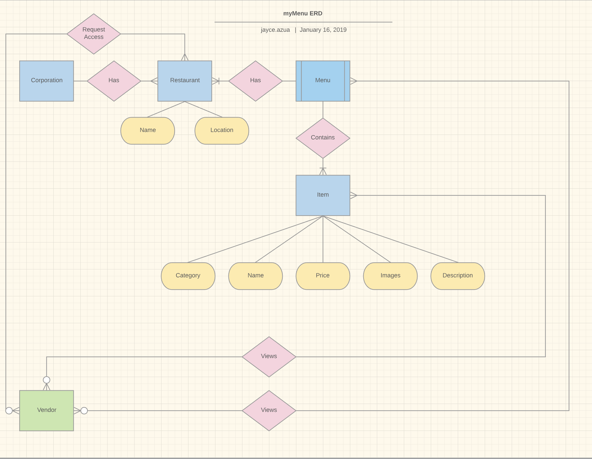

# DigitalMenu

**Front end React app: https://github.com/AwesomeZaidi/Digital-Menu-Frontend**

## API Endpoints
### User Profiles
**`POST /users/v0/signup`**  
    - **Arguments:** fullName, email, password.
    - **Returns:**   user obj created in database, header set.

**`POST /users/v0/login`**   
    - **Arguments:** email, password.
    - **Returns:**   user obj, header set.
    
**`DELETE /users/v0/logout`**   
    - **Arguments:** email, password.
    - **Returns:**   user obj, header set.

### Restaurants
**`INDEX GET /restaurant`**   
    - **Arguments:** A user logged.
    - **Returns:** Returns all the restaurants from the specific user logged in. An array of restaurant objects.
**`CREATE POST /restaurant`**   
    - **Arguments:** restaurantName
    - **Returns:** Returns a status of 200 if successfully created and 404 error code if there is an error.
**`READ GET /restaurant/:id`**   
    - **Arguments:** Restaurant Id in the uri params.
    - **Returns:** It will return the restaurant name and the list of objectIds of locations associated to that restaurant.  
**`UPDATE PATCH /restaurant/:id`**   
    - **Arguments:** restaurantName
    - **Returns:** Status of 200 if successful or 404 if there is an error
**`DELETE DELETE /restaurant/:id`**   
    - **Arguments:** restaurant Id in the uri params.
    - **Returns:** Status of 200 if successful or 404 if there is an error

### Locations
**`INDEX GET /restaurant/:id/location`**   
    - **Arguments:** Restautant Id in the uri params.
    - **Returns:** An array of objects of the restaurants' locations

**`CREATE POST /restaurant/:id/location`**   
    - **Arguments:** location address, restaurant id in the params
    - **Returns:** status of 200 or error statrus 404

**`READ GET /restaurant/:id/location/:id`**   
    - **Arguments:** restaurantId/locationId in the params
    - **Returns:** It will return the restaurantId, the location address, the list of objectIds of items associated to that location.

**`UPDATE PATCH /restaurant/:id/location/:id`**   
    - **Arguments:** restaurantId/locationId in the params, location address
    - **Returns:** status of 200 or error statrus 404  

**`DELETE DELETE /restaurant/:id/location/:id`**   
    - **Arguments:** restaurantId/locationId in the params
    - **Returns:** status of 200 or error statrus 404 

### User Narratives
 - As a user, I want to update, add, or delete an individual item from my menu database, in order to have my entire menu organize in one single source of truth.
 - As a user, I want to be able to login, in order to view my restaurant’s menu.
 - As a user, I want to give out different API Keys to vendors, in order to allow them to get a secure access to my menu.
  - As a user, I want to manage my vendors, in order to delete and add vendors that are allowed to use my menu.
 - As a vendor, I want to make a GET request to the restaurant’s menu, in order to display it in my application (i.g. GrubHub, Website, POS, Postmates, etc).
 - As a vendor, I want to make a GET request for an individual item in the restaurant’s menu, in order to display that into my hosted application.

### User Journey
After finishing a meeting with GrubHub, Victoria was asked to give GrubHub an updated version of Pinecrest Bakery’s complete menu. On top of GrubHub, Victoria has made several deals with other online ordering vendors like Uber Eats, Postmates, MealPal, and DoorDash. Even has a redesign company website, which all are demanding a updated complete menu of Pinecrest Bakery. Victoria is easily able to send a link of her online digital menu database. A full detailed menu that all vendors can easily access through a simple RESTful API. She can also update any changes on the menu and will update automatically to all the locations Pinecrest Bakery displays their menu. Victoria is excited to see how much time she has saved from using a single source of truth for her menu. Victoria does not need to struggle anymore like before to update each individual application in case there is a price or item change in the menu. 

### Wireframe
[Live Update](https://balsamiq.cloud/s282s2f/pve4ia6)
### Entity Relationship Diagram
